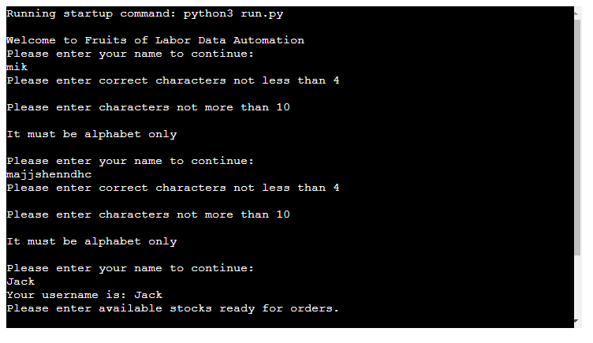
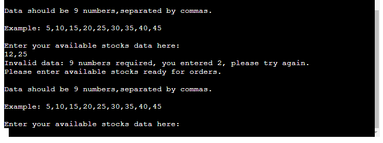
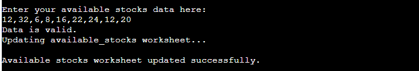
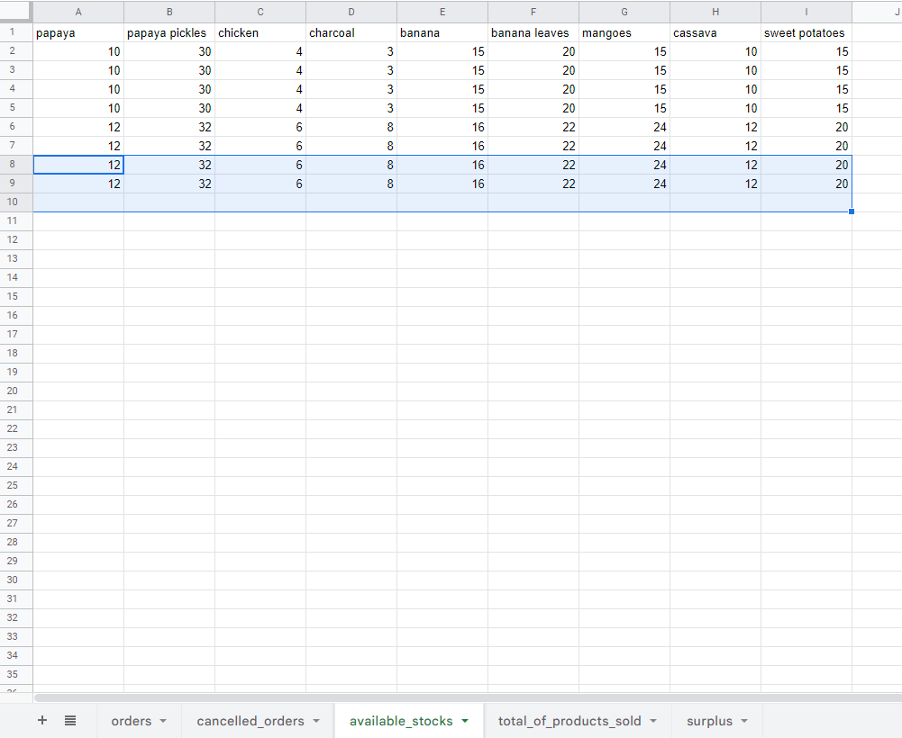
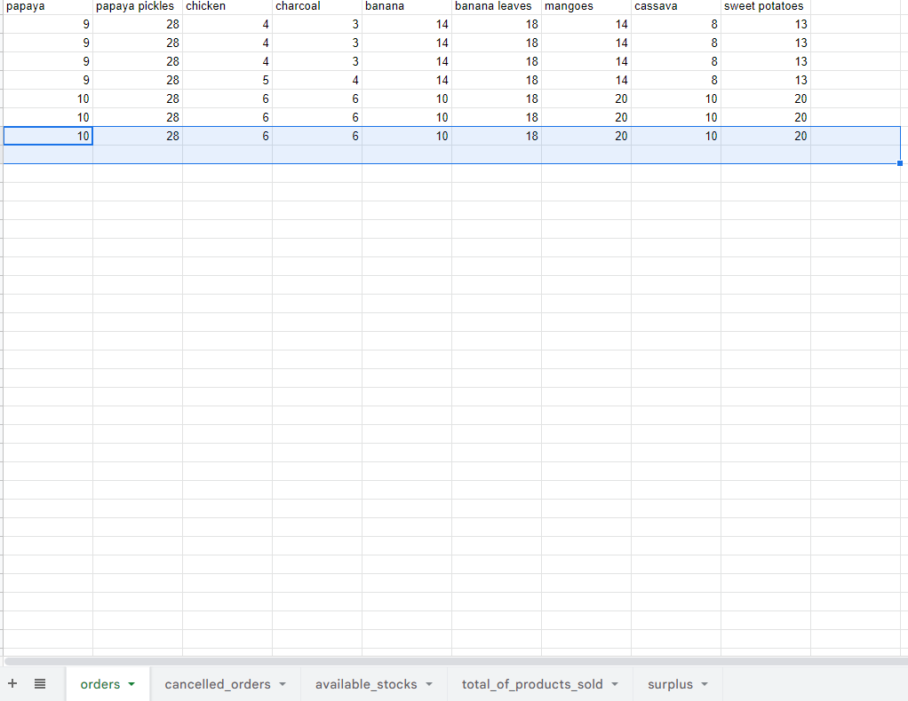
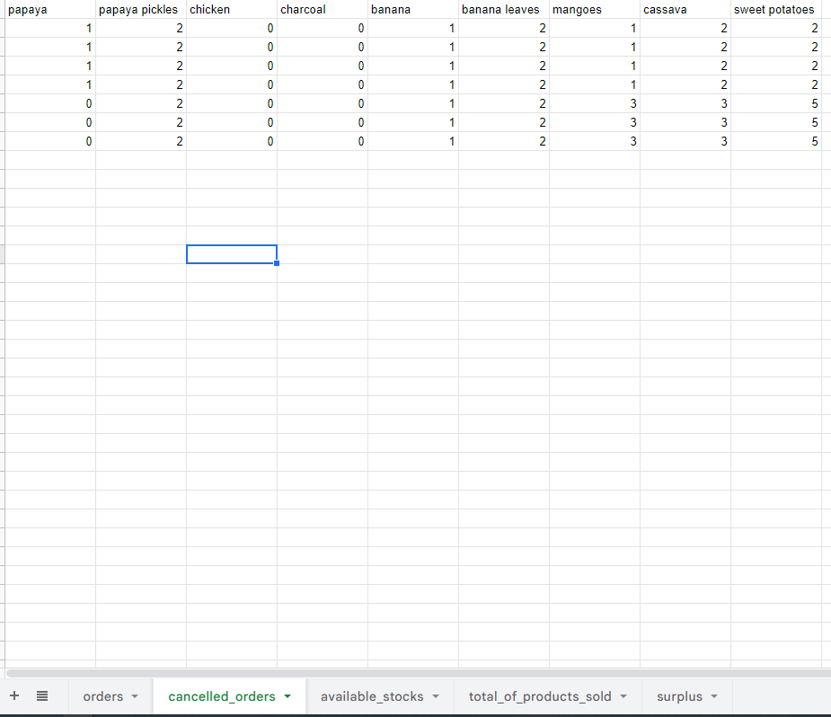
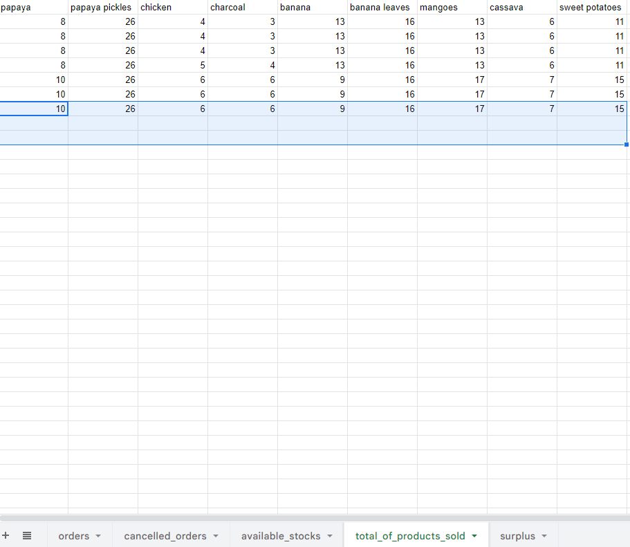
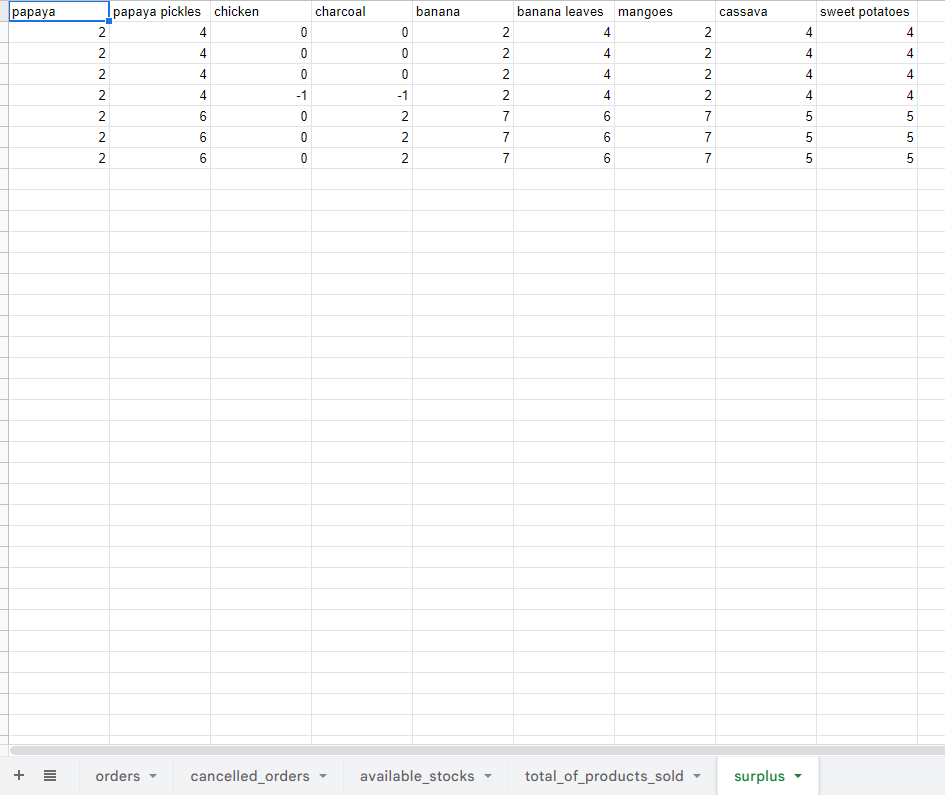

# Fruits of Labor
Fruits of Labor is Python terminal program, which runs in the Code Institute terminal in Heroku app.

It is a data automation based on a real life data of products of my parents source of income of our family farm but with a fictional numbers.They post the available products in social media and they get the orders.

The program will ask the user to enter their username before inputting available stocks, orders, cancelled orders and then calculate the total products sold and the surplus to end the program.

[Here is the live version of my Fruits of labor data anamation project.](https://fruits-of-labor.herokuapp.com/)

## Testing username input validation

* If the user entered incorrect input this following will be printed in the terminal:

  * Please enter correct characters not less than 4
  * Please enter characters not more than 10
  * It must be alphabet only

  

## Testing input validation of available_stocks, orders and cancelled orders

If the user entered incorrect data the following will be printed in the terminal:

  * Please enter available stocks ready for orders
  * Data should be 9 numbers,separated by commas
  * Example: 5,10,15,20,25,30,35,40,45

  

The methods are the same for orders and cancelled orders.
If the data is valid, this will be printed in the terminal

## Checking if the data is sucessfully updated in the worksheet

* Here are the screenshot images of the data that had been sucessfully update in the workcsheet:
  
  Available_stocks

  

  Orders

   

  Cancelled orders

   

  Total of products sold

   

  Surplus

   

## Testing
I have manually tested this project by doing the following:

  * Passed the code through a PEP8 linter, there are trailing whitespace in the code and did a google search and with that information it say that this can be ignored but I will try to learn how to use that function on how to remove it.
  * Tested in my local terminal and the Code Institute Heroku terminal and the program is working.

## Bugs

  ## Fixed Bugs
  * I have to abbreviate my variables in surplus_data function as it is too long and removed the continue keyword in the get_username function as hinted in the editor that this cannot be nested in a function.

## Deployment

This project was deployed using Code Institute's mock terminal for Heroku.

  * Steps for deployment:
    * Fork or clone repository
    * Create a new Heroku app
    * Set the buildpacks to [Python](https://www.python.org/) and [NodeJS](https://nodejs.org/en/) in that order
    * Link the Heroku app to the repository
    * Click on Deploy
 
 
 

